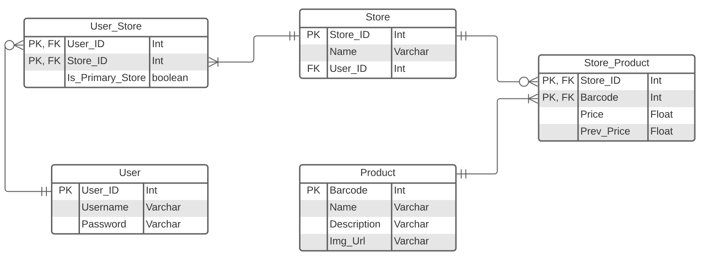

# Retail Prices

## Description
Retail Prices is a mobile application that allows retail shoppers to compare last months' prices of products with the current months' prices. This can help shoppers make informed decision as to whether they are losing money when purchasing a product or they are saving.

# Functionality
The app should allow the customer to scan a product:
- if a product does not exist, query the customer to add the product or 'cancel'
- if the product exists, display the previous price and query the customer to update price or 'cancel'

# integration
the application cross-references all customers previous scanned prices to keep the database updated.

## to-do list
create an ERD for the database
create pages for viewing in shopping-list, create a checking mechanism for the products,
create a page to scan the products.

# Database information

## The ERD for the DB

this ERD is straight forward. 3 tables that will help me store user credentials, store which stores they shop from and which products have been captured on the application and their prices
